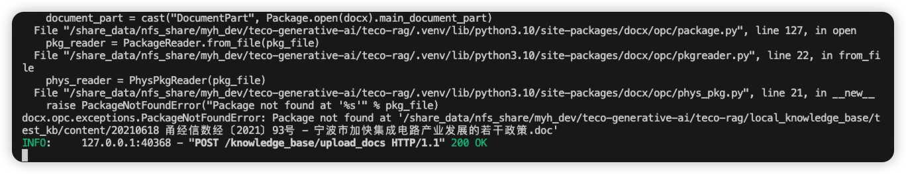

群公告
赛事介绍录屏：
https://www.bilibili.com/video/BV1S6mKYdEAd
Teco-RAG参考文档：
https://gitee.com/tecorigin/teco-generative-ai/blob/master/teco-rag/README.md
参赛指南：
https://gitee.com/tecorigin/teco-generative-ai/blob/master/teco-rag/docs/openatom_competition_guide.md
------------------
大模型参赛id：
https://docs.qq.com/sheet/DZUZlZkttY1pESkxO?is_no_hook_redirect=1
数据集&评测问题集网盘链接：https://pan.baidu.com/s/1Z6HftAe2ixqwZN-xqBx0UA?pwd=pwr0 
提取码：pwr0tiktoken


# 显卡信息

teco-smi

# embedding模型下载
```
git clone https://hf-mirror.com/chuxin-llm/Chuxin-Embedding /share_data/models/Chuxin-Embedding
```

# rerank 模型下载
```
git clone https://hf-mirror.com/BAAI/bge-reranker-large /share_data/models/bge-reranker-large
modelscope download --model Xorbits/bge-reranker-large --local_dir /share_data/models/bge-reranker-large
```

# TODO

- [ ] 开启多查询
- [ ] 分析文章片段得分小于0.4的问题在哪, 大概有1/10的文档得分小于0.4, 这些是要重点关注的badcase
- [ ] summary 将summary设置为1即可开启该优化方法，可以通过大模型为切分好的chunk生成一个摘要。在索引构建阶段，对摘要进行向量化，但在检索阶段召回的文档是原chunk。
- [ ] 关键词基于BM25的多路召回: 从向量数据库中查询document信息, 就可以用于构建我的BM25的关键词召回, 组合到一起再进行RERANK, NOTE: 有点麻烦, 现在是向量召回10个, rerank5个
    - [ ] https://www.perplexity.ai/search/milvus-de-hybrid-searchzui-jia-9g6QLzOMQLmoQAfNKwT85g
    - https://milvus.io/blog/introducing-pymilvus-integrations-with-embedding-models.md
    - https://python.langchain.com/docs/integrations/components/

# BUG
doc无法处理, 暂时本地转成docx
