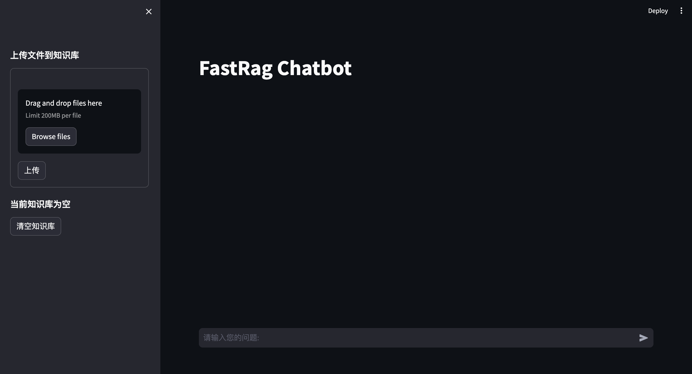
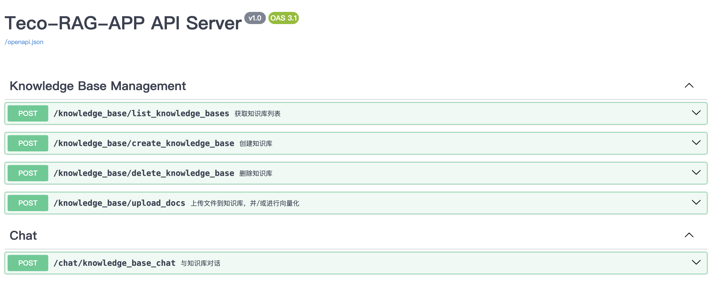

# 部署指南

Teco-RAG部署需要经过以下四个步骤：
1. 安装环境依赖：安装Teco-RAG所需要的环境依赖。
2. 部署依赖服务：部署向量数据库和大模型推理服务。
3. 配置参数：针对安装环境和算法策略进行参数配置。
5. 启动Teco-RAG服务：针对原生Web UI或定制UI启动对应的服务。

## 1 安装环境依赖

### 环境要求

| 分类          | 说明                                                         |
| ------------- | ------------------------------------------------------------ |
| 操作系统      | Linux/Windows/MacOS                                          |
| 系统架构      | x86                                                          |
| 语言版本      | Python 3.9及以上版本                                         |
| Miniconda版本 | Miniconda3 Linux 64-bit，参考[Miniconda](https://docs.conda.io/projects/miniconda/en/latest/miniconda-other-installer-links.html)的安装手册进行安装。 |

### 安装依赖

1. 执行以下命令，创建虚拟环境：

   ```Shell
   conda create --name <env_name> python=<python_version>
   ```

   其中：

   - `<env_name>`：虚拟环境名称。

   - `<python_version>`：Python版本。

2. 执行以下命令，进入虚拟环境：

   ```Shell
   conda activate <env_name>
   ```

   其中，`<env_name>`表示虚拟环境名称。

3. 执行以下命令，拉取仓库：

   ```Shell
   git clone https://gitee.com/tecorigin/teco-generative-ai.git
   ```

4. 执行以下命令，进入目录：

   ```Shell
   cd teco-generative-ai/teco-rag/
   ```

5. 执行以下命令，安装环境依赖：

   ```Shell
   pip install -r requirements.txt -i https://pypi.tuna.tsinghua.edu.cn/simple
   pip install http://mirrors.tecorigin.com/repository/teco-pypi-repo/packages/teco-client-toolkits/0.0.1/teco_client_toolkits-0.0.1-py3-none-any.whl
   ```

## 2 部署依赖服务

RAG系统中，向量数据库和大模型是必备的功能组件，在Teco-RAG中都是以在线服务的形式接入。

### 2.1 向量数据库

Teco-RAG当前仅支持[Milvus](https://milvus.io/)作为向量数据库，其它主流向量数据库会陆续兼容。

#### 2.1.1 部署Milvus


Milvus服务部署可参考[官网教程](https://milvus.io/docs/install-overview.md)，请根据实际业务场景选择合适的部署方式。

#### 2.2.2（可选）管理Milvus

[Attu](https://github.com/zilliztech/attu)是一个多合一的 Milvus GUI管理工具，推荐使用该工具对Milvus进行调试，可以方便地看到接入的知识库详情。

### 2.2 大模型推理服务
Teco-RAG支持多平台部署，可以接入以下算力平台的大模型推理服务：
- 方式一：Teco-LLM-Inference（部署在太初加速卡）
- 方式二：vLLM（部署在NVIDIA GPU卡）
- 方式三：OpenAI在线推理服务

#### 方式一：Teco-LLM-Inference
部署在太初加速卡上，请联系太初元碁以获取技术支持。

#### 方式二：vLLM
推荐通过vLLM启动部署在NVIDIA GPU卡上的大模型推理服务，详见[OpenAI Compatible Server — vLLM](https://docs.vllm.ai/en/latest/serving/openai_compatible_server.html#command-line-arguments-for-the-server)。

#### 方式三：OpenAI在线推理服务
OpenAI在线推理服务无需部署，请确保已购买相关模型并保持网络通畅。

## 3 配置参数

启动Teco-RAG服务前，需要修改组件配置和算法策略的相关配置，以便Teco-RAG服务可以正常启动。根据启动Teco-RAG服务方式的不同，选择以下一种参数配置方法：

- 修改配置文件：适用于一键启动服务，支持启动API服务和Web UI服务。
- 新建配置文件：适用于容器化方式启动服务，仅支持启动API服务。

### 方式一：修改配置文件

在配置文件[/conf/config.yaml](../conf/config.yaml)中替换原配置参数，参数项定义详见[参数说明](../docs/configuration.md)。

**注意**：参数说明中**是否需要自定义**列为 ✅ 的参数，请在启动服务前正确配置。

### 方式二：新建配置文件

1. 新建后缀为.env的配置文件（例如container.env）。

2. 在配置文件中填写需要修改的参数项的环境变量和参数值，每一行都是key=value格式，不要有注释信息。例如：

   ```text
   APP_VECTOR_STORE_TYPE=milvus
   APP_VECTOR_STORE_HOST=x.x.x.x
   APP_VECTOR_STORE_PORT=19530
   APP_EMBEDDINGS_MODEL_NAME_OR_PATH=/models/bge-embedding-zh
   APP_EMBEDDINGS_MODEL_ENGINE=huggingface
   APP_RERANKER_MODEL_NAME_OR_PATH=/models/bge-reranker-zh
   ...
   ```
   
   参数项的环境变量名详见[参数说明](../docs/configuration.md)。
   
   **注意**：参数说明中**是否需要自定义**列为 ✅ 的参数，请在启动服务前正确配置。

## 4. 启动Teco-RAG服务
Teco-RAG支持原生Web UI和定制UI的两种方式进行使用。

- 原生Web UI：支持一键式启动。
- 定制UI：支持一键式启动和容器化启动两种方式启动后端API服务。

**注意**：一键式启动和容器化启动两种启动方式互斥。

### 4.1 原生Web UI

您可以在Teco-RAG的界面中上传知识库文件并进行知识问答。

1. 执行以下命令，一键式启动原生Web UI服务：

   ```Shell
   cd teco-rag/
   python start.py
   ```

2. 浏览器访问 ``http://<host>:<port>``，能够打开对话界面，表示服务启动成功。

   其中：
   
   - `<host>`：部署Teco-RAG的主机地址。
   
   - `<port>`：Web UI服务的访问端口。可通过conf/config.yaml中的`server.web_server_port`进行修改
   
    <div style="text-align: center;">  </div>

**后续操作**

参考[使用指南](service.md)上传知识库文件，并进行知识问答。

### 4.2 定制UI

您可以基于Teco-RAG提供的API适配其它系统的前端，满足定制化UI的诉求。支持一键式启动和容器化启动。

**注意**：以下两种启动方式互斥，且如果一键式启动了原生Web UI服务，将不支持容器化启动后端API服务。

#### 方式一：一键式启动

执行以下命令，启动后端API服务。

**说明**：如果已经启动了原生Web UI，则后端API服务的端口不能和Web UI服务的端口重合。

```Shell
cd teco-rag/
python server/main.py --host 0.0.0.0 --port <SERVER_PORT> --create_tables
```

其中，`<SERVER_PORT>` 表示后端API服务的访问端口。

**执行结果**

浏览器访问 ``http://<host>:<port>/docs``，能够打开FastAPI docs界面，表示服务启动成功。

其中：

- `<host>`：部署Teco-RAG的主机地址。

- `<port>`：后端API服务的访问端口。

<div style="text-align: center;">  </div>

**后续操作**

参考[使用指南](service.md)，基于Teco-RAG提供的API适配其它系统的前端。

#### 方式二：容器化启动

**前提条件**

请确保机器已安装Docker。

**操作步骤**

1. 执行以下命令，对Teco-RAG应用进行打包：

   ```shell
   cd teco-rag/
   bash build.sh
   ```

2. 执行以下命令，启动后端API服务：

   ```shell
   LOCAL_MODEL_DIR=<LOCAL_MODEL_DIR>
   docker run -itd -v $LOCAL_MODEL_DIR:/models --name teco_rag_app --net=host --privileged=true \
         --env-file container.env -e SERVER_HOST=0.0.0.0 -e SERVER_PORT=9003 Teco-RAG:1.0.0
   ```

   其中，`<LOCAL_MODEL_DIR> `表示本地存储模型的路径，注意Embedding Model和Rerank Model参数都要存储在该路径下。

**执行结果**

浏览器访问 ``http://<host>:<port>/docs``，能够打开FastAPI docs界面，表示服务启动成功。

其中：

- `<host>`：部署Teco-RAG的主机地址。

- `<port>`：后端API服务的访问端口。可通过在环境变量文件`container.env`中设置`APP_WEB_SERVER_PORT`参数进行修改

<div style="text-align: center;">  </div>

**后续操作**

参考[使用指南](service.md)，基于Teco-RAG提供的API适配其它系统的前端。
