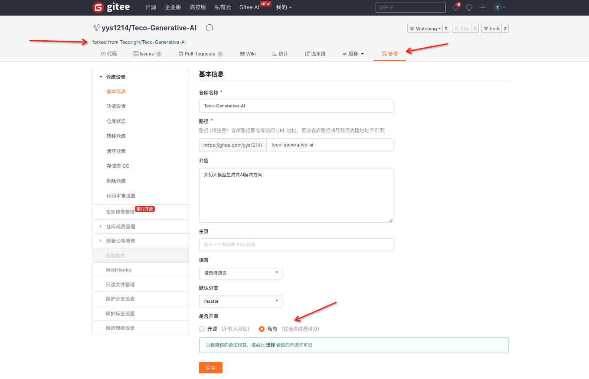

# 参赛指南

各位亲爱的太初生态伙伴们！首先，我们衷心感谢您对我们太初的关注与支持。我们专注于为深度学习领域提供高性能，高能效的智能算力解决方案。 我们以大模型技术为核心搭建了LLM-RAG原型开发框架：Teco-RAG，致力于为企业用户提供快速、准确的知识问答服务。 我们相信，通过与您的紧密合作和共同探索，我们的硬件产品将能够更好地服务于AI社区，推动人工智能技术的发展与应用。

本文档将向您详细介绍参加 **[Teco-RAG 大模型开发任务挑战赛](https://competition.atomgit.com/competitionInfo?id=16a77e510f7e4009638b820eb945bd7c)** 的流程和注意事项。

## 机器资源
本赛事为每个参赛团队都准备了开发机器和太初AI加速卡，**登录机器后进入的是一个独立的容器**。开赛后机器登录信息将在微信群中公布。

## 基于Teco-RAG开发

参赛选手必须使用太初自研的[Teco-RAG框架](https://gitee.com/tecorigin/teco-generative-ai/tree/master/teco-rag)来搭建RAG知识问答系统。
请先将代码仓库Fork到个人空间。
接着可以参考[部署指南](deployment.md)和[使用指南](service.md)了解如何使用Teco-RAG快速搭建并使用知识问答服务，
最后，根据[开发指南](development.md)开发新功能。

**为避免代码抄袭，本Gitee仓库已设置PR互相不可见。此外，参赛选手请将个人fork的仓库从“开源”设置为“私有”，避免被抄袭**。
<div style="text-align: left;">  </div>


## 部署大模型推理服务
本赛事要求参赛者只能部署`Qwen-7B-Chat`大模型推理服务，使用其它方式接入大模型推理服务的方案皆视为无效。

为了提高开发效率，我们已经为参赛者在开发机器上挂载了镜像并构建了容器，按照以下流程即可部署大模型推理服务：

1. 登录分配给各位参赛者的机器，进入已经启动的容器环境：
```shell
conda activate tecoinferencelm

# 安装tiktoken
pip install tiktoken

# 配置环境变量
MPI_HOME=/usr/local/openmpi-4.0.1 
PATH=$MPI_HOME/bin:$PATH 
LD_LIBRARY_PATH=$MPI_HOME/lib:$LD_LIBRARY_PATH
```
2. 配置TecoInferenceEngine（大模型）推理后端。容器的dist-packages目录下已安装Triton的推理后端动态库。 执行以下命令，将推理后端动态库拷贝到Triton的tritonserver/backends目录中。
```shell
cp -r /root/miniconda/envs/tecoinferencelm/lib/python3.10/site-packages/tecoinferencelm/backends/teco_inferenceenginelm/ /opt/tritonserver/backends/
```
3. 用户可以根据使用需求判断是否需要开启并发推理功能，请选择对应的命令启动Triton服务：
   1. 不需要开启并发推理功能
   ```shell
   /opt/tritonserver/bin/tritonserver --model-repository=/mnt/nvme/Qwen-7B-Chat/model_configs/Qwen-7B-Chat 
   ```
   2. 开启并发推理功能
   ```shell
   FT_CB_BATCH_SIZE=14 FT_PAGE_ATTENTION=ON FT_CB_MAX_INPUT_LEN=4096 FT_CB_MAX_OUTPUT_LEN=1024 /opt/tritonserver/bin/tritonserver --model-repository=/mnt/nvme/Qwen-7B-Chat/model_configs/Qwen-7B-Chat
   # FT_CB_BATCH_SIZE为并发数量，请根据实际需求进行设置
   ```
   **注意：开启并发推理功能后，第一次调用需发送 >= FT_CB_BATCH_SIZE 的并发请求进行预热，可直接运行以下脚本来实现**
   ```shell
   # 先确保已安装 teco-client-toolkits包
   pip install http://mirrors.tecorigin.com/repository/teco-pypi-repo/packages/teco-client-toolkits/0.0.1/teco_client_toolkits-0.0.1-py3-none-any.whl
   python concurrency_warm_up.py --ip 127.0.0.1 --port 8001 --qps <qps>
   # <qps> 请设置为 >= FT_CB_BATCH_SIZE的正整数
   ```
   ```python
   # concurrency_warm_up.py
   from typing import List, Callable, Generator,Dict
   import argparse
   from concurrent.futures import ThreadPoolExecutor, as_completed
   from teco_client_toolkits import ClientRequest, TritonRequestParams, ApiType
   
   
   def build_input(question):
       _prompt = """<|im_start|>system\nYou are a helpful assistant.<|im_end|>\n<|im_start|>user\n{Input}<|im_end|>\n<|im_start|>assistant\n"""
       prompt = _prompt.format(History_input="", History_output="", Input=question)
       return prompt
   
   
   def run_in_thread_pool(func: Callable, params: List[Dict]=[]) -> Generator:
       tasks = []
       with ThreadPoolExecutor() as pool:
           for kwargs in params:tasks.append(pool.submit(func, **kwargs))
           for obj in as_completed(tasks): yield obj.result()
   
   
   def get_parser():
       parser = argparse.ArgumentParser(prog='Teco-LLM-Infer_Concurrency_WarmUp')
       parser.add_argument("--ip", type=str)
       parser.add_argument("--port", type=int)
       parser.add_argument("--qps", type=int)
       return parser.parse_args()
   
   
   def call_teco_llm_infer(question, q_id, ip, port):
       client = ClientRequest(ip=ip, port=port)
       param = TritonRequestParams(mode="non-ensemble",
                                   max_new_tokens=1024,
                                   start_id=1,
                                   end_id=151643,
                                   topk=1,
                                   topp=0,
                                   temperature=1.0,
                                   len_penalty=1.0,
                                   repetition_penalty=1.0,
                                   stop_words_list=[["<|im_end|>"]],
                                   protocol='grpc')
       result = client.request(prompts=build_input(question), api_type=ApiType.TRITON, stream=True, params=param).streamer
       res = ""
       for out in result: res = out['outputs']
       return res, q_id
   
   
   if __name__ == '__main__':
       args = get_parser()
       params = [{"question": "介绍一下英伟达这家公司", "ip": args.ip, "port": args.port, "q_id": i+1} for i in range(args.qps)]
       for res, q_id in run_in_thread_pool(call_teco_llm_infer, params=params):
           print(q_id, res)
   ```

   如果能打印出如下格式的信息，则说明启动成功。请保存该输出信息中的端口号。
   ```shell
   I1030 22:33:28.291908 1 grpc_server.cc:2513] Started GRPCInferenceService at 0.0.0.0:8001
   I1030 22:33:28.292879 1 http_server.cc:4497] Started HTTPService at 0.0.0.0:8000
   I1030 22:33:28.335154 1 http_server.cc:270] Started Metrics Service at 0.0.0.0:8002
   ```

## 部署向量数据库
本赛事推荐使用Milvus部署向量数据库。但由于本赛事提供的开发环境是一个Docker容器，若根据官方教程以Docker部署Milvus可能会因为Docker嵌套问题导致部署失败，可任选以下一种方案解决：

1. 若参赛者有公网服务器资源，可选择在自己的公网服务器上[以Docker方式部署Milvus服务](https://milvus.io/docs/install_standalone-docker.md)，再将milvus的连接信息配置到系统中。
2. 也可选择在容器中启动Milvus本地轻量级服务。可参考以下两种方法，任选其一即可：
   1. 参考Milvus官方文档[在本地部署轻量级Milvus服务](https://milvus.io/docs/milvus_lite.md)，用该方法接入Milvus需要修改Teco-RAG框架中的[milvus connector](https://gitee.com/tecorigin/teco-generative-ai/blob/master/teco-rag/rag/connector/vectorstore/milvus.py)实现，例如通过pymilvus连接服务的方式等。
   2. 通过`milvus.default_server`在本地快速部署轻量化服务，该方法不需要修改Teco-RAG的实现方法，只需要将[vector_store](https://gitee.com/tecorigin/teco-generative-ai/blob/master/teco-rag/docs/configuration.md#1-vector_store)的host参数配置为 `localhost` 即可。
      ```python
      # 先安装milvus
      # pip install milvus
         
      from milvus import default_server
      default_server.wait_for_started = False
         
      def start_server():
          default_server.start()
         
      def stop_server():
          default_server.stop()
         
      if __name__ == '__main__':
          with default_server:
              start_server()
      ```


## 使用其它模型
除了大模型之外，参赛者可以自由使用其它开源模型来优化RAG方案，包括embedding、rerank模型等。
我们强烈推荐您选择太初自研的嵌入模型：[Chuxin-Embedding](https://huggingface.co/chuxin-llm/Chuxin-Embedding)
> Chuxin-Embedding 是专为增强中文文本检索能力而设计的嵌入模型。
> 它基于bge-m3-retromae，实现了预训练、微调、精调全流程。该模型在来自各个领域的大量语料库上进行训练，语料库的批量非常大。
> 截至 2024年9月14日, Chuxin-Embedding 在检索任务中表现出色，在 C-MTEB 中文检索排行榜上排名第一，领先的性能得分为 77.88，在AIR-Bench中文检索+重排序公开排行榜上排名第一，领先的性能得分为 64.78。

**为了方便组委会在赛后复现参赛方案和评测结果，请将方案中使用的模型数据都下载保存到``/models``目录下**。

例如：某参赛者使用`BAAI/bge-large-zh`和`BAAI/bge-reranker-large`分别作为RAG系统中的embedding和rerank模型，
那么``/models``目录下必须有这两个模型的数据文件：
```text
 - /models
    |- bge-large-zh
        |- ...
    |- bge-reranker-large
        |- ...
    |- ...
```
并且将该对应的路径配置到`conf/config.yaml`中的合适位置：
```text
embeddings:

  model_name_or_path: /models/bge-large-zh

  ......

reranker:

  model_name_or_path: /models/bge-reranker-large
  
  ......
```

## 参赛ID
报名参加比赛后，会得到一个**参赛id**（在微信群中公布），例如`000001`，这是各参赛选手/团队的唯一标识，也是后续提交评测和方案的认证标识，请妥善保管。

## 比赛数据
开赛后会在微信群中发布数据下载链接。包含「原始语料」、「评测问题集」、「数据说明文档」等内容。
本赛题使用的数据均来自于：太初官方产品文档、太初公众号内容，公司宣传资料、彩页、超算、国产数据中心、算子等相关资料。

## 申请初赛评测

初赛阶段采用结果提交的方式进行线上评审，由自动化打分工具对参赛作品进行评分。评测开启时间将在微信群中公布。

### 准备工作

初赛阶段使用一个公开的问题集作为评测数据，开赛后将在微信群中发布下载链接。
```json
[
  {"id": 1, "question": "在配置开发环境时需要安装哪几个包？"}, 
  {"id": 2, "question": "TecoToolKit安装流程"}
]
```
每次申请评测前，请根据以下步骤进行操作：
1. 请为每个问题生成答案，并按照json格式存储。文件名必须命名为`predict.json`：
```json
[
  {"id": 1, "question": "在配置开发环境时需要安装哪几个包？", "answer": "太初加速卡的环境安装包是由基础软件、加速库及训推框架组成的一套适配太初加速卡的软件组合，由 TecoDriver 和 TecoToolKit 安装包组成"},
  {"id": 2, "question": "TecoToolKit安装流程", "answer": "1. 检测环境是否满足需求（MLNX_OFED、MPI等）。2. 获取TecoToolKit软件安装包。3. 安装TecoToolKit软件安装包。4. 配置环境变量。"}
]
```
2. 将`predict.json`文件push到个人代码仓的`teco-generative-ai/teco-rag/eval/`目录下。

### 首次申请初赛评测
准备好待评测文件后，通过**提交PR**来申请初赛阶段的在线评测，**目标分支请选择`/tecorigin/teco-generative-ai:openatom_eval`**，注意事项如下：

PR标题请包含以下内容：前缀关键词、比赛名称、参赛id及评测日期

例如本次赛事是开放原子比赛，并且是初赛阶段，标题请参考 **[eval]: 开放原子比赛(初赛)-000001-20240919**

PR内容应包括但不限于这些信息：
1. 个人代码仓库链接。
2. 相比于主仓方案，简单说明已实现的优化策略。

### 后续申请评测
**本仓库管理员不会关闭申请初赛评测的PR，也请参赛者不要主动关闭该PR，后续再次申请初赛评测时，只需要将`predict.json`文件更新并提交到该PR的源分支即可**。

自动评分工具会识别到PR的更新状态，并自动执行新一轮的评测。

### 注意事项

- 申请评测的PR标题中必须带有`eval` 前缀关键词，否则不会被评测工具自动识别。
- 每个参赛团队每天最多提交一次评测。在申请评测前，请确保上一次申请的评测已完成。**若恶意提交多个评测申请PR，将依次扣除后续评测机会**。
- 评测工具会在`每天上午11点`自动拉取过去24小时内的评测申请并执行评测，上午11点后提交的评测申请将在后一天执行。
- 若执行评测时报错导致评测失败，将由技术保障同学定位BUG并协助参赛者解决问题，最后手动触发该评测流程，手动触发不会消耗额外的评测机会。**非工作日出现评测失败问题，将在下一个工作日统一处理。**
- 评测执行完成后，评测工具会将评分自动评论在申请评测的PR下，同时管理员会将最新评测结果更新至赛题榜单中，然后关闭该PR

## 申请决赛线上评测

决赛阶段分为现在线上自动评测和线下专家评分两个阶段，这里介绍申请线上自动评分的流程。

决赛采用线上私榜评测方式，选手将看不到最终的评测题目。参赛选手通过提交PR申请评测，自动化打分工具读取到PR信息后会自动拉取参赛者的Gitee代码仓指定分支，构建本地RAG知识问答服务，并基于该服务在问题集上进行评测，最后根据评测结果实时更新榜单排名。

### 准备工作

在提交申请评测的PR前，请务必确保每次申请评测前，可使用待评测分支代码通过一键启动的方法完成系统部署。
若由于配置信息错误、执行流程bug等问题未达到预期效果，后果由参赛者自行承担，评测工具只负责执行评测流程。

### 首次提交PR申请决赛线上评测
通过提交PR来申请决赛阶段的在线评测，**目标分支请选择`/tecorigin/teco-generative-ai:openatom_eval`**，注意事项如下：

PR标题请包含以下内容：前缀关键词、比赛名称、参赛id及评测日期

例如本次赛事是开放原子比赛，并且是决赛阶段，标题请参考 **[eval]: 开放原子比赛(决赛)-000001-20240919**

PR内容应包括但不限于这些信息：

个人代码仓库链接。
相比于主仓方案，简单说明已实现的优化策略。

### 后续申请决赛线上评测
**本仓库管理员不会关闭申请决赛线上评测的PR，也请参赛者不要主动关闭该PR，后续再次申请决赛线上评测时，只需要将最新代码提交到该PR的源分支即可。**

自动评分工具会识别到PR的更新状态，并自动执行新一轮的评测。

### 注意事项

- 申请评测的PR标题中必须带有`eval` 前缀关键词，否则不会被评测工具自动识别。
- 每个参赛团队每天最多提交一次评测。在申请评测前，请确保上一次申请的评测已完成。**若恶意提交多个评测申请PR，将依次扣除后续评测机会**。
- 决赛阶段提交评测申请后，会立即执行评测，非工作日提交的评测申请将顺延到下一个工作日执行。
- 相较于初赛阶段，决赛评测时需要重新构建知识库，所以需要更长的评测时间。
- 若执行评测时报错导致评测失败，将由技术保障同学定位BUG并协助参赛者解决问题，最后手动触发该评测流程，手动触发不会消耗额外的评测机会。**非工作日出现评测失败问题，将在下一个工作日统一处理。**
- 评测执行完成后，评测工具会将评分自动评论在申请评测的PR下，同时管理员会将最新评测结果更新至赛题榜单中。

## 提交参赛方案

完成比赛后，通过PR提交最终方案 **目标分支请选择`/tecorigin/teco-generative-ai:openatom_proposal`**：

PR标题请包含以下内容：前缀关键词（proposal）、比赛名称、参赛id， 例如：

- 完成``开放原子比赛``初赛后提交初赛方案，标题请参考 **[proposal]: 开放原子比赛-000001-初赛方案**
- 完成``开放原子比赛``决赛后提交最终方案，标题请参考 **[proposal]: 开放原子比赛-000001-最终方案**

**PR内容应包括但不限于这些信息**：
1. 方案详细介绍：文档、截图、演示视频等形式皆可。
2. 最终线上评测结果，以最后一次提交评测为准。
3. 参赛期间提交的PR列表，包括PR链接以及处理结果。

以上内容将作为结果复现、代码审查、决赛专家评分等阶段的重要参考依据

### 注意事项
- **只有提交了方案才算完成比赛，初赛阶段也需要提交，否则不计入最终排名**
- 提交方案后，该代码分支请不要再修改，以免影响后续专家评分

## 贡献代码
欢迎参赛选手在比赛中为本项目贡献高质量代码，**贡献代码的PR数量和代码质量也将被作为专家评分的重要参考依据**，PR规范请参考[文档](pull-requests.md)。

**目标分支请选择`/tecorigin/teco-generative-ai:openatom`**

贡献代码时，请新建一个分支专门用于实现准备贡献的功能模块，请勿和申请评测和提交最终方案混用同一个分支，并且保证一个PR只贡献一个独立的功能模块。


## FAQs

**Q: 部署服务时报错：缺少`libGL.so.1`** \
A: 容器环境问题，执行以下命令卸载`opencv-python`，安装`opencv-python-headless`即可: 
```shell
pip uninstall opencv-python
pip install opencv-python-headless
```

**Q: 在赛事提供的开发机器中部署Teco-RAG知识问答系统后，如何在本地访问WebUI体验问答功能** \
A: 本赛事为每位参赛者提供的开发环境为独立的容器，为了安全考虑没有开放端口，但开发者可以通过编辑器（例如vscode）连接开发环境，再将RAG服务转发到本地端口，就可以在本地访问WebUI服务了。
具体可参考[教程](https://blog.csdn.net/web_green/article/details/136941057)。